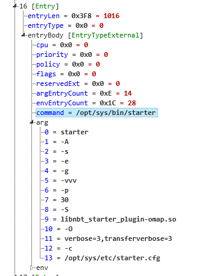

# qnx_boot_script_parser.ksy

This is a QNX boot script parser for Kaitai Struct. It is capable of parsing the compiled '.script' files used in the startup process of the QNX operating system.

Specifically, this parser has been tested against a QNX 6.5.0 boot script, and is intended to generate a human-readable structure from the binary .script file.

## Usage

Simply upload the script to the [Kaitai Struct web IDE](https://ide.kaitai.io/) along with your .script file for parsing.

## Example Parsing Output

## TODO Items / Known Issues

- Currently, entry type 0x05 (extended scheduler) is unhandled - it is simply dumped into a string.
- Unknown/unhandled entries are also currently dumped into a string.
- The parser probably works fine with most newer versions of QNX, you just have to make sure the structure of the .script file hasn't changed.
